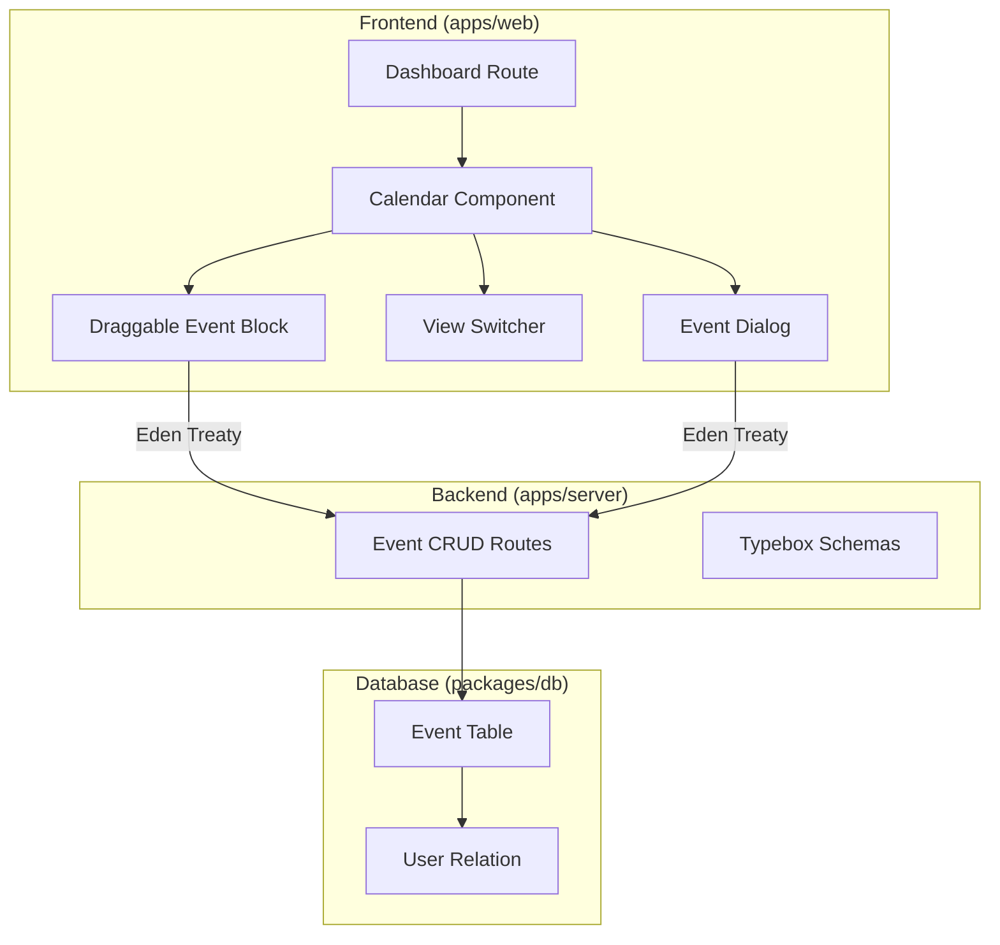
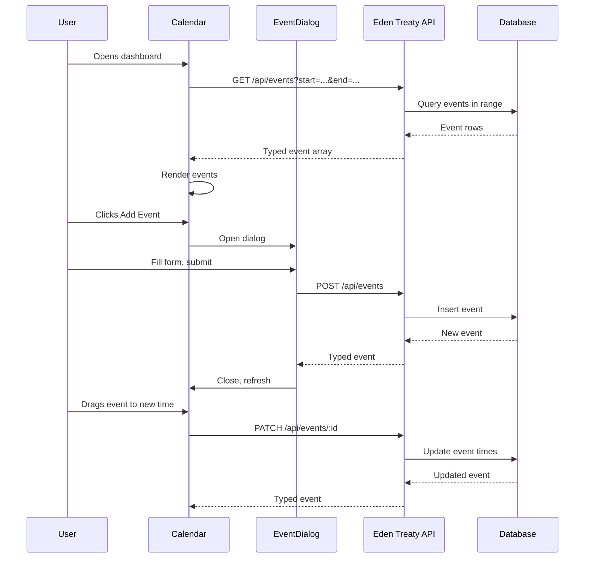

# Calendar View Implementation

## Architecture Overview




## Required shadcn Components to Install

You will need to install these additional shadcn components:

- `dialog` - for event creation/edit popup
- `popover` - for color picker
- `select` - for view switching dropdown
- `scroll-area` - for calendar time grid scrolling
- `separator` - for visual dividers
- `textarea` - for event description

---

## Phase 1: Database Schema

Create [`packages/db/src/schema/events.ts`](packages/db/src/schema/events.ts) with:

```typescript
export const event = pgTable("event", {
  id: text("id").primaryKey().$defaultFn(() => crypto.randomUUID()),
  userId: text("user_id").notNull().references(() => user.id, { onDelete: "cascade" }),
  title: text("title").notNull(),
  description: text("description"),
  startTime: timestamp("start_time").notNull(),
  endTime: timestamp("end_time").notNull(),
  isAllDay: boolean("is_all_day").default(false).notNull(),
  color: text("color").default("#3b82f6").notNull(), // Default blue
  createdAt: timestamp("created_at").defaultNow().notNull(),
  updatedAt: timestamp("updated_at").defaultNow().$onUpdate(() => new Date()).notNull(),
}, (table) => [
  index("event_userId_idx").on(table.userId),
  index("event_startTime_idx").on(table.startTime),
]);
```

Update [`packages/db/src/schema/index.ts`](packages/db/src/schema/index.ts) to export events.---

## Phase 2: Backend API Routes

Add event routes to [`apps/server/src/index.ts`](apps/server/src/index.ts) using Elysia with Typebox:

```typescript
// Event CRUD endpoints with Typebox schemas
.get("/api/events", handler, { 
  query: t.Object({ start: t.String(), end: t.String() }),
  response: t.Array(EventSchema) 
})
.post("/api/events", createHandler, { body: CreateEventSchema, response: EventSchema })
.patch("/api/events/:id", updateHandler, { body: UpdateEventSchema, response: EventSchema })
.delete("/api/events/:id", deleteHandler, { response: t.Object({ success: t.Boolean() }) })
```

All endpoints will validate the user session and scope queries to the authenticated user.---

## Phase 3: Eden Treaty Client Usage

The `api` client from `apps/web/src/lib/api.ts` provides end-to-end type-safe API calls using Eden Treaty. Here's how to use it for event CRUD operations:

### API Client Setup

```typescript
// apps/web/src/lib/api.ts
import { treaty } from "@elysiajs/eden";
import type { App } from "@server/index";

export const api = treaty<App>(import.meta.env.VITE_SERVER_URL || "");
```


### Fetching Events (GET)

```typescript
import { api } from "@/lib/api";

// GET /api/events with query parameters
const fetchEvents = async (start: Date, end: Date) => {
  const { data, error } = await api.api.events.get({
    query: {
      start: start.toISOString(),
      end: end.toISOString(),
    },
  });

  if (error) {
    throw new Error(`Failed to fetch events: ${error.status}`);
  }

  return data; // Fully typed as Event[]
};
```


### Creating an Event (POST)

```typescript
import { api } from "@/lib/api";

const createEvent = async (eventData: {
  title: string;
  description?: string;
  startTime: Date;
  endTime: Date;
  isAllDay: boolean;
  color: string;
}) => {
  const { data, error } = await api.api.events.post(eventData);

  if (error) {
    throw new Error(`Failed to create event: ${error.status}`);
  }

  return data; // Typed as Event
};
```


### Updating an Event (PATCH)

```typescript
import { api } from "@/lib/api";

const updateEvent = async (
  id: string,
  updates: Partial<{
    title: string;
    description: string;
    startTime: Date;
    endTime: Date;
    isAllDay: boolean;
    color: string;
  }>
) => {
  // Dynamic route parameter via bracket notation
  const { data, error } = await api.api.events[id].patch(updates);

  if (error) {
    throw new Error(`Failed to update event: ${error.status}`);
  }

  return data; // Typed as Event
};
```


### Deleting an Event (DELETE)

```typescript
import { api } from "@/lib/api";

const deleteEvent = async (id: string) => {
  const { data, error } = await api.api.events[id].delete();

  if (error) {
    throw new Error(`Failed to delete event: ${error.status}`);
  }

  return data; // Typed as { success: boolean }
};
```


### React Query Integration (useEvents Hook)

```typescript
// apps/web/src/hooks/use-events.ts
import { useQuery, useMutation, useQueryClient } from "@tanstack/react-query";
import { api } from "@/lib/api";

export const useEvents = (start: Date, end: Date) => {
  const queryClient = useQueryClient();

  const eventsQuery = useQuery({
    queryKey: ["events", start.toISOString(), end.toISOString()],
    queryFn: async () => {
      const { data, error } = await api.api.events.get({
        query: {
          start: start.toISOString(),
          end: end.toISOString(),
        },
      });
      if (error) throw error;
      return data;
    },
  });

  const createMutation = useMutation({
    mutationFn: async (eventData: CreateEventInput) => {
      const { data, error } = await api.api.events.post(eventData);
      if (error) throw error;
      return data;
    },
    onSuccess: () => {
      queryClient.invalidateQueries({ queryKey: ["events"] });
    },
  });

  const updateMutation = useMutation({
    mutationFn: async ({ id, ...updates }: UpdateEventInput & { id: string }) => {
      const { data, error } = await api.api.events[id].patch(updates);
      if (error) throw error;
      return data;
    },
    onSuccess: () => {
      queryClient.invalidateQueries({ queryKey: ["events"] });
    },
  });

  const deleteMutation = useMutation({
    mutationFn: async (id: string) => {
      const { data, error } = await api.api.events[id].delete();
      if (error) throw error;
      return data;
    },
    onSuccess: () => {
      queryClient.invalidateQueries({ queryKey: ["events"] });
    },
  });

  return {
    events: eventsQuery.data ?? [],
    isLoading: eventsQuery.isLoading,
    error: eventsQuery.error,
    createEvent: createMutation.mutateAsync,
    updateEvent: updateMutation.mutateAsync,
    deleteEvent: deleteMutation.mutateAsync,
  };
};
```

---

## Phase 4: Frontend Calendar Components

### Core Calendar Structure

| Component | Location | Purpose ||-----------|----------|---------|| `Calendar` | `components/calendar/calendar.tsx` | Main container, manages view state and event data || `CalendarHeader` | `components/calendar/calendar-header.tsx` | View switcher, date navigation, add event button || `DayView` | `components/calendar/views/day-view.tsx` | Single day with 1-hour time slots || `WeekView` | `components/calendar/views/week-view.tsx` | 7-day grid with 1-hour time slots || `MonthView` | `components/calendar/views/month-view.tsx` | Traditional month grid || `YearView` | `components/calendar/views/year-view.tsx` | 12-month overview || `TimeGrid` | `components/calendar/time-grid.tsx` | Reusable time slot grid for day/week views || `EventBlock` | `components/calendar/event-block.tsx` | Draggable, resizable event component || `EventDialog` | `components/calendar/event-dialog.tsx` | Create/edit event popup with form || `ColorPicker` | `components/calendar/color-picker.tsx` | Preset color selection using Popover |

### Drag and Drop / Resize Implementation

The drag and resize functionality will be implemented using native HTML5 drag events and pointer events:

- **Drag**: `onDragStart`, `onDrag`, `onDragEnd` on EventBlock + `onDragOver`, `onDrop` on time slots
- **Resize**: Pointer events on edge handles (top/bottom for vertical resize)

Position calculations will convert pixel offsets to time deltas based on the 1-hour slot height.

### Event Dialog Fields

- Title (required)
- Description (optional)
- Start date/time
- End date/time  
- All-day toggle (hides time pickers when enabled)
- Color picker (preset palette: blue, green, red, yellow, purple, pink, orange, teal)

---

## Phase 5: Data Flow



---

## File Changes Summary

### New Files

- `packages/db/src/schema/events.ts` - Event database schema
- `apps/web/src/components/calendar/calendar.tsx` - Main calendar container
- `apps/web/src/components/calendar/calendar-header.tsx` - Header with controls
- `apps/web/src/components/calendar/views/day-view.tsx` - Day view
- `apps/web/src/components/calendar/views/week-view.tsx` - Week view (default)
- `apps/web/src/components/calendar/views/month-view.tsx` - Month view
- `apps/web/src/components/calendar/views/year-view.tsx` - Year view
- `apps/web/src/components/calendar/time-grid.tsx` - Time slot grid

---

## Testing Harness

### Prerequisites

> **Important**: This testing harness uses the **dev database** that is already running. You do **NOT** need to:

> - Run `bun db:start` - the database container is already running

> - Run `bun db:generate` - schema generation is not required for dev testing

> - Run `bun db:migrate` - migrations will be applied as needed, but not required for initial testing

### Step 1: Start the Dev Server

Run the full development environment:

```bash
bun dev
```

This starts both the web app (`apps/web`) and the API server (`apps/server`) concurrently.

### Step 2: Add Console Logging to API Routes

Add these console logs to `apps/server/src/index.ts` for debugging API calls:

```typescript
// Add at the top of each event route handler

// GET /api/events
console.log("[Events API] GET /api/events", { start, end, userId: user.id });
console.log("[Events API] Fetched events:", events.length, "events found");

// POST /api/events
console.log("[Events API] POST /api/events", { body: ctx.body, userId: user.id });
console.log("[Events API] Created event:", newEvent.id);

// PATCH /api/events/:id
console.log("[Events API] PATCH /api/events/:id", { id: ctx.params.id, updates: ctx.body });
console.log("[Events API] Updated event:", updatedEvent);

// DELETE /api/events/:id
console.log("[Events API] DELETE /api/events/:id", { id: ctx.params.id });
console.log("[Events API] Deleted event successfully");
```


### Step 3: Add Console Logging to useEvents Hook

Add these console logs to `apps/web/src/hooks/use-events.ts`:

```typescript
// In eventsQuery
queryFn: async () => {
  console.log("[useEvents] Fetching events for range:", { start, end });
  const { data, error } = await api.api.events.get({
    query: { start: start.toISOString(), end: end.toISOString() },
  });
  if (error) {
    console.error("[useEvents] Fetch error:", error);
    throw error;
  }
  console.log("[useEvents] Fetched events:", data);
  return data;
},

// In createMutation
mutationFn: async (eventData) => {
  console.log("[useEvents] Creating event:", eventData);
  const { data, error } = await api.api.events.post(eventData);
  if (error) {
    console.error("[useEvents] Create error:", error);
    throw error;
  }
  console.log("[useEvents] Created event:", data);
  return data;
},

// In updateMutation
mutationFn: async ({ id, ...updates }) => {
  console.log("[useEvents] Updating event:", { id, updates });
  const { data, error } = await api.api.events[id].patch(updates);
  if (error) {
    console.error("[useEvents] Update error:", error);
    throw error;
  }
  console.log("[useEvents] Updated event:", data);
  return data;
},

// In deleteMutation
mutationFn: async (id) => {
  console.log("[useEvents] Deleting event:", id);
  const { data, error } = await api.api.events[id].delete();
  if (error) {
    console.error("[useEvents] Delete error:", error);
    throw error;
  }
  console.log("[useEvents] Deleted event:", data);
  return data;
},
```


### Step 4: Add Console Logging to Calendar Components

Add these console logs to key calendar components:

```typescript
// In calendar.tsx
console.log("[Calendar] Current view:", currentView);
console.log("[Calendar] Date range:", { start: viewStart, end: viewEnd });
console.log("[Calendar] Events loaded:", events.length);

// In event-block.tsx
console.log("[EventBlock] Drag start:", { eventId: event.id, originalTime: event.startTime });
console.log("[EventBlock] Drag end:", { eventId: event.id, newTime: calculatedTime });
console.log("[EventBlock] Resize:", { eventId: event.id, newDuration: duration });

// In event-dialog.tsx
console.log("[EventDialog] Opening:", { mode: isEditing ? "edit" : "create", event });
console.log("[EventDialog] Submitting:", formData);
```


### Step 5: Manual Test Checklist

Open the browser at `http://localhost:5173` (or your configured port) and test:

#### Basic Rendering

- [ ] Calendar loads without errors
- [ ] Week view displays correctly as default
- [ ] Time grid shows 24-hour slots
- [ ] Current time indicator visible (if implemented)

#### View Switching

- [ ] Switch to Day view - console logs view change
- [ ] Switch to Month view - console logs view change
- [ ] Switch to Year view - console logs view change
- [ ] Switch back to Week view

#### Date Navigation

- [ ] Click "Next" - date range updates in console
- [ ] Click "Previous" - date range updates in console
- [ ] Click "Today" - returns to current week

#### Event Creation

- [ ] Click "Add Event" button - dialog opens
- [ ] Fill form and submit - console shows POST request
- [ ] New event appears on calendar
- [ ] Server logs show event created

#### Event Editing

- [ ] Click on existing event - dialog opens in edit mode
- [ ] Modify fields and save - console shows PATCH request
- [ ] Event updates on calendar
- [ ] Server logs show event updated

#### Drag and Drop

- [ ] Drag event to new time slot - console shows drag events
- [ ] Drop event - console shows PATCH request with new time
- [ ] Event position updates on calendar

#### Event Resizing

- [ ] Drag event edge to resize - console shows resize events
- [ ] Release - console shows PATCH request with new duration
- [ ] Event duration updates on calendar

#### Event Deletion

- [ ] Open event dialog, click delete - console shows DELETE request
- [ ] Event removed from calendar
- [ ] Server logs show event deleted

### Step 6: Browser DevTools Verification

Check these in the browser developer console:

1. **Network Tab**: Verify API calls to `/api/events` with correct query params
2. **Console Tab**: Confirm all `[useEvents]` and `[Calendar]` logs appear
3. **React DevTools**: Inspect Calendar component state and props

### Troubleshooting

| Issue | Check |

|-------|-------|

| Events not loading | Server console for DB connection errors |

| 401 Unauthorized | Ensure you're logged in, check session cookie |

| Events not rendering | Browser console for React errors |

| Drag/drop not working | Console logs in EventBlock component |

| API errors | Network tab for response body details |

### Remove Logging for Production

Before merging, remove or gate all console.log statements:

```typescript
// Option 1: Remove all console.log statements
// Option 2: Use a debug flag
const DEBUG = import.meta.env.DEV;
if (DEBUG) console.log("[Events API]", ...);

```