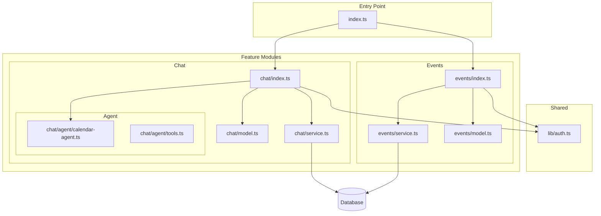

# Feature-Based Server Structure Migration

## Target Structure

```
apps/server/src/
  index.ts              # Clean entrypoint, composes modules
  lib/
    auth.ts             # Shared auth utilities (getSessionUser)
  modules/
    events/
      index.ts          # Elysia controller (routes)
      service.ts        # Business logic (DB operations)
      model.ts          # TypeBox schemas
    chat/
      index.ts          # Elysia controller (routes)
      service.ts        # Business logic (tool execution)
      model.ts          # TypeBox schemas
      agent/            # Moved from src/agent/
        calendar-agent.ts
        tools.ts
  google-calendar.ts    # Keep as-is
```

## Implementation Steps

### 1. Create shared auth utility

Create [`apps/server/src/lib/auth.ts`](apps/server/src/lib/auth.ts) with the `getSessionUser` function extracted from index.ts.

### 2. Create Events module

**Model** ([`apps/server/src/modules/events/model.ts`](apps/server/src/modules/events/model.ts)):

- Move `EventSchema`, `CreateEventBody`, `UpdateEventBody`, and the `DateFromString` transformer

**Service** ([`apps/server/src/modules/events/service.ts`](apps/server/src/modules/events/service.ts)):

- Abstract class with static methods for: `list`, `create`, `update`, `delete`
- Decoupled from Elysia context - receives only the data it needs

**Controller** ([`apps/server/src/modules/events/index.ts`](apps/server/src/modules/events/index.ts)):

- Elysia instance with `/api/events` routes
- Handles HTTP concerns (auth, validation, responses)
- Delegates business logic to service

### 3. Create Chat module

**Model** ([`apps/server/src/modules/chat/model.ts`](apps/server/src/modules/chat/model.ts)):

- Move chat-related TypeBox schemas (message structure, execute body/response)

**Service** ([`apps/server/src/modules/chat/service.ts`](apps/server/src/modules/chat/service.ts)):

- Abstract class with static methods for: `executeToolCall`
- Contains the switch logic for `createEvent`, `updateEvent`, `deleteEvent`

**Controller** ([`apps/server/src/modules/chat/index.ts`](apps/server/src/modules/chat/index.ts)):

- Elysia instance with `/api/chat` routes
- Handles streaming response from agent

### 4. Refactor main index.ts

Simplify [`apps/server/src/index.ts`](apps/server/src/index.ts) to:

- Configure CORS
- Mount auth handler
- Health check route
- Compose modules via `.use()`

```typescript
const app = new Elysia()
  .use(cors({ ... }))
  .mount(auth.handler)
  .get("/", () => ({ status: "ok", timestamp: Date.now() }))
  .use(events)
  .use(chat)
  .listen(env.PORT);
```

### 5. Move agent files

Move the existing `src/agent/` folder contents into the chat module at `src/modules/chat/agent/`:

- [`apps/server/src/modules/chat/agent/calendar-agent.ts`](apps/server/src/modules/chat/agent/calendar-agent.ts)
- [`apps/server/src/modules/chat/agent/tools.ts`](apps/server/src/modules/chat/agent/tools.ts)

### 6. Cleanup

Delete the old `src/agent/` folder after migration is complete.

## Architecture Diagram


