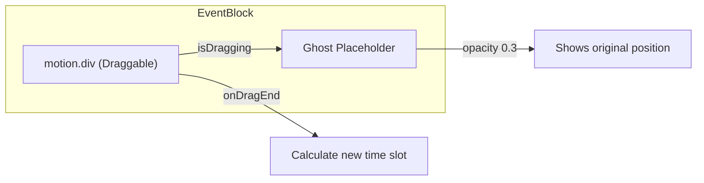

# Refactor Event Drag-and-Drop with Framer Motion

## Current State

The drag-and-drop functionality in [`event-block.tsx`](apps/web/src/components/calendar/event-block.tsx) uses the native HTML5 Drag API with manual `dataTransfer` handling. The current implementation:

- Uses `draggable` attribute on a button
- Hides the native drag image and manually tracks position
- Applies `opacity-50` during drag to the original element
- Handles drop in [`time-grid.tsx`](apps/web/src/components/calendar/time-grid.tsx) via `onDrop`/`onDragOver`

## Proposed Architecture

Replace the native drag API with Motion's `drag` prop, maintaining a "ghost" placeholder at the original position:




## Implementation Plan

### 1. Refactor EventBlock Component

Convert the event block to use Motion's `drag` system:

```tsx
// New structure in event-block.tsx
<>
  {/* Ghost placeholder - visible only when dragging */}
  {isDragging && (
    <div 
      className="..." 
      style={{ ...style, opacity: 0.3 }}
    >
      {/* Same content as main event */}
    </div>
  )}
  
  <motion.button
    drag
    dragConstraints={constraintRef}
    dragElastic={0}
    dragMomentum={false}
    whileDrag={{ scale: 1.02, zIndex: 50 }}
    onDragStart={() => setIsDragging(true)}
    onDragEnd={(event, info) => {
      setIsDragging(false);
      // Calculate new position from info.offset
    }}
  >
    {/* Event content */}
  </motion.button>
</>
```

Key changes:

- Use `motion.button` with `drag` prop instead of native `draggable`
- Track `isDragging` state to conditionally render ghost placeholder
- Ghost renders at original position with `opacity: 0.3`
- Use `dragConstraints` with a ref to the parent column
- Use `dragElastic={0}` and `dragMomentum={false}` for precise positioning
- Calculate new time from `info.offset` in `onDragEnd`

### 2. Update TimeGrid for Constraint Refs

Pass constraint refs to EventBlock for bounded dragging:

- Create refs for each date column in TimeGrid
- Pass `constraintRef` prop to EventBlock
- Remove native `onDrop`/`onDragOver` handlers (no longer needed)

### 3. Handle Cross-Column Dragging

For dragging events between days:

- Allow both X and Y axis dragging (`drag={true}`)
- In `onDragEnd`, calculate the target column based on X offset and column width
- Determine new date/time from combined X (day) and Y (hour) offsets

## Files to Modify

1. [`apps/web/src/components/calendar/event-block.tsx`](apps/web/src/components/calendar/event-block.tsx) - Main refactor to Motion
2. [`apps/web/src/components/calendar/time-grid.tsx`](apps/web/src/components/calendar/time-grid.tsx) - Add constraint refs, remove native drag handlers

## Notes

- The Motion library is already installed (`"motion": "^12.24.0"`)