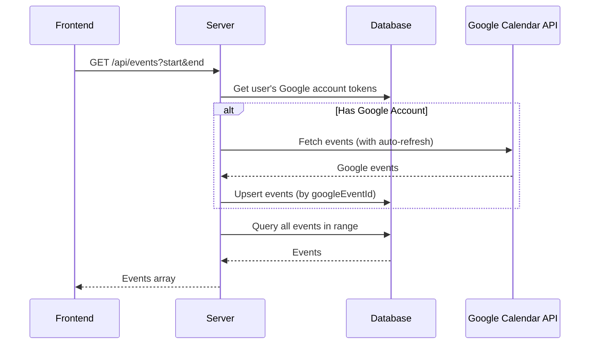

# Google Calendar integration


## Architecture




## Changes

### 1. Update Event Schema

Add `googleEventId` and `googleCalendarId` fields to [packages/db/src/schema/events.ts](packages/db/src/schema/events.ts):

```typescript
googleEventId: text("google_event_id"),      // Google's event ID
googleCalendarId: text("google_calendar_id"), // Which Google calendar it came from
```

Add a unique index on `(userId, googleEventId)` to prevent duplicates.

### 2. Create Google Calendar Service

Create new file `apps/server/src/google-calendar.ts` with:

- `getGoogleOAuth2Client(userId)` - Creates OAuth2 client with stored tokens, handles auto-refresh via `googleapis` built-in mechanism
- `syncGoogleCalendarEvents(userId, timeMin, timeMax)` - Fetches events from Google Calendar and upserts into database

Key implementation details:

- Use `google.calendar({ version: "v3" })` from `googleapis`
- Query the `account` table where `providerId = "google"` to get tokens
- Set credentials on OAuth2 client including refresh token
- Use `calendar.events.list()` with `singleEvents: true` to expand recurring events
- Upsert logic: if `googleEventId` exists for user, update; otherwise insert

### 3. Integrate Sync into Events Endpoint

Modify `GET /api/events` in [apps/server/src/index.ts](apps/server/src/index.ts) to:

1. Check if user has a linked Google account
2. If yes, call `syncGoogleCalendarEvents()` before querying local events
3. Return combined results from database

The sync happens transparently on every calendar load - no separate sync button needed.

### 4. Handle Events from Google

When importing Google events:

- `title` = `event.summary`
- `description` = `event.description`
- `startTime` / `endTime` from `event.start.dateTime` or `event.start.date` (all-day)
- `isAllDay` = true if only `date` is present (no `dateTime`)
- `color` = "#4285f4" (Google blue) or map from `event.colorId`
- `googleEventId` = `event.id`
- `googleCalendarId` = "primary" (or the calendar ID used)

## Harness

After implementation, verify with:

```bash
# 1. Push schema changes to local DB
bun db:push

# 2. Type check all packages
bun check-types

# 3. Start dev server
bun dev
```

Test by:

1. Sign in with Google OAuth