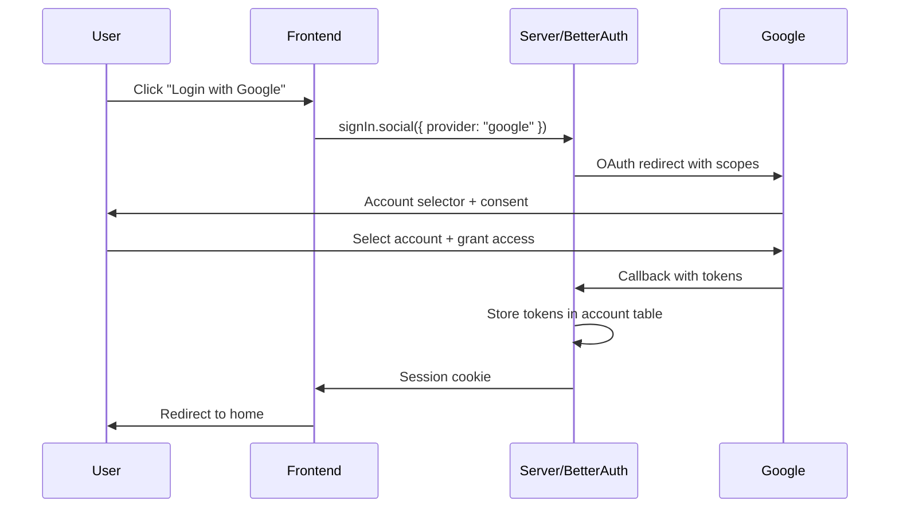

# Add Google OAuth with Calendar Scopes

## Overview

Integrate Google OAuth into your existing Better Auth setup with:

- Account selection prompt (always show chooser)
- Refresh token persistence (offline access)
- Google Calendar read/write scopes for future calendar sync

## Architecture




## Implementation Steps

### 1. Configure Google OAuth Provider

Update [`packages/auth/src/index.ts`](packages/auth/src/index.ts) to add the Google social provider with:

- `prompt: "select_account"` - Always show account chooser
- `accessType: "offline"` - Get refresh tokens
- `scope` - Include Google Calendar read/write permissions
```ts
socialProviders: {
  google: {
    clientId: process.env.GOOGLE_CLIENT_ID as string,
    clientSecret: process.env.GOOGLE_CLIENT_SECRET as string,
    prompt: "select_account",
    accessType: "offline",
    scope: [
      "openid",
      "email",
      "profile",
      "https://www.googleapis.com/auth/calendar.events"
    ],
  },
},
```


### 2. Add Environment Variables

Add to server environment (referenced in [`turbo.json`](turbo.json)):

- `GOOGLE_CLIENT_ID` - From Google Cloud Console
- `GOOGLE_CLIENT_SECRET` - From Google Cloud Console
- `BETTER_AUTH_URL` - Base URL for OAuth callback construction

Update `turbo.json` to include these in the env array for the server task.

### 3. Wire Up Frontend Google Buttons

Update [`sign-in-form.tsx`](apps/web/src/components/sign-in-form.tsx) and [`sign-up-form.tsx`](apps/web/src/components/sign-up-form.tsx):

```ts
const handleGoogleSignIn = async () => {
  await authClient.signIn.social({
    provider: "google",
  });
};
```

Attach to existing Google buttons via `onClick={handleGoogleSignIn}`.

### 4. Google Cloud Console Setup (Manual)

You'll need to:

1. Create OAuth 2.0 credentials in Google Cloud Console
2. Enable the Google Calendar API
3. Add authorized redirect URIs:

- `http://localhost:3000/api/auth/callback/google` (dev)
- `https://your-domain.com/api/auth/callback/google` (prod)

## Files to Modify