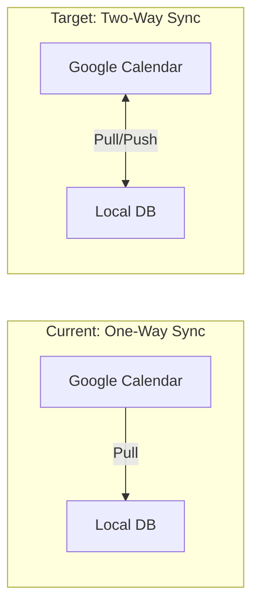
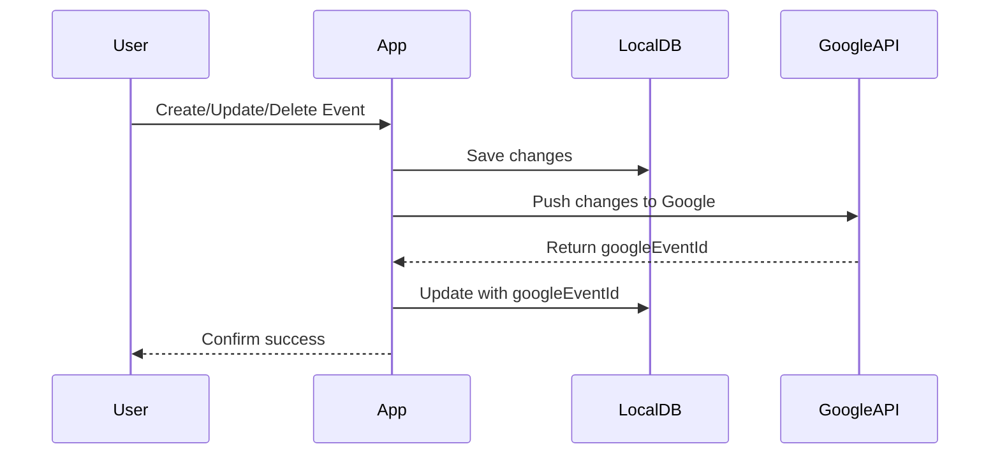

# Two-Way Google Calendar Sync

## Current State

The app currently has **one-way sync** (Google Calendar to local DB). When events are listed, `syncGoogleCalendarEvents` pulls events from Google and stores them locally. However, local changes (create/update/delete) do not sync back to Google.

## OAuth Scopes

The current scope `https://www.googleapis.com/auth/calendar.events` in [`packages/auth/src/index.ts`](packages/auth/src/index.ts) already provides **read-write access** to calendar events. No scope changes are needed.

## Implementation Plan

### 1. Add Google Calendar Write Functions

Extend [`apps/server/src/google-calendar.ts`](apps/server/src/google-calendar.ts) with:

- `createGoogleEvent(userId, calendarId, eventData)` - Insert event via Google API, return `googleEventId`
- `updateGoogleEvent(userId, calendarId, googleEventId, eventData)` - Patch event in Google
- `deleteGoogleEvent(userId, calendarId, googleEventId)` - Delete event from Google
- `getDefaultCalendarId(userId)` - Get the primary calendar ID for creating new events

### 2. Update Events Service

Modify [`apps/server/src/modules/events/service.ts`](apps/server/src/modules/events/service.ts):

- **Create**: After inserting locally, call `createGoogleEvent()` and save the returned `googleEventId`
- **Update**: If event has `googleEventId`, call `updateGoogleEvent()` to sync changes
- **Delete**: If event has `googleEventId`, call `deleteGoogleEvent()` before removing locally

### 3. Update Agent Calendar Tools

Modify [`apps/server/src/modules/chat/agent/tools.ts`](apps/server/src/modules/chat/agent/tools.ts):

Apply the same sync logic to `createEvent`, `updateEvent`, and `deleteEvent` tools so AI-initiated changes also sync to Google.

### 4. Error Handling Strategy

- Wrap Google API calls in try-catch to prevent local operations from failing if Google sync fails
- Log sync errors but still complete local operations
- Consider adding a `syncStatus` or `syncError` field to events (optional enhancement)

## Data Flow

